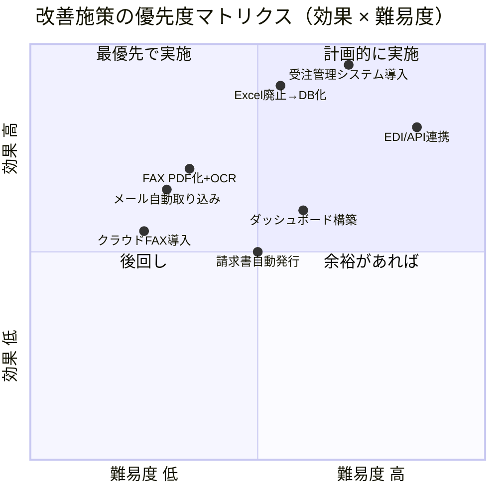
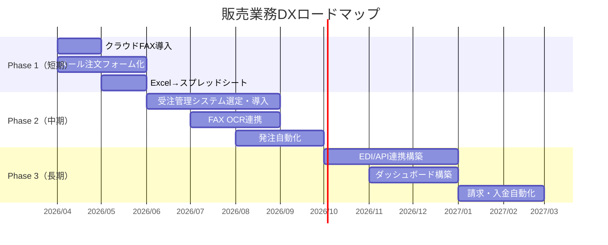

# 改善ポイント一覧と優先度マトリクス

## 優先度マトリクス

---

## 改善施策一覧

### Phase 1：すぐに着手（短期 〜3ヶ月）

| # | 施策 | 現状 | 改善後 | 期待効果 | 導入コスト |
|---|------|------|--------|----------|-----------|
| 1 | **クラウドFAX導入** | 紙FAXで受信・送信 | eFax等でPDF受信・送信 | 紙コスト削減、外出先でも確認可 | 低 |
| 2 | **メールの定型化** | 自由形式のメール受注 | 注文フォーム（Googleフォーム等）に誘導 | 入力ミス削減、自動取り込み可能に | 低 |
| 3 | **Excel → スプレッドシート移行** | ローカルExcelファイル | Googleスプレッドシート（共有） | 同時編集・リアルタイム共有 | 低 |

### Phase 2：計画的に実施（中期 3〜6ヶ月）

| # | 施策 | 現状 | 改善後 | 期待効果 | 導入コスト |
|---|------|------|--------|----------|-----------|
| 4 | **受注管理システム導入** | Excel手入力 | クラウド販売管理（例: freee, MFクラウド, 楽楽販売） | 手入力廃止・データ一元管理 | 中 |
| 5 | **FAX受注のOCR化** | 紙FAXを目視で確認 | OCR読取→システム自動入力 | 入力時間大幅削減 | 中 |
| 6 | **発注書の自動生成・送信** | 紙で作成→FAX送信 | システムから自動生成→メール/クラウドFAX送信 | 作成・送信時間を90%削減 | 中 |

### Phase 3：本格DX（長期 6〜12ヶ月）

| # | 施策 | 現状 | 改善後 | 期待効果 | 導入コスト |
|---|------|------|--------|----------|-----------|
| 7 | **取引先とのEDI/API連携** | 個別対応 | システム間自動データ連携 | 完全自動化・リアルタイム連携 | 高 |
| 8 | **ダッシュボード構築** | Excel集計 | BIツールでリアルタイム可視化 | 即時に状況把握・意思決定迅速化 | 中〜高 |
| 9 | **請求・入金管理の自動化** | 手作業で請求書発行・入金確認 | システム自動発行・消込 | 経理業務の大幅効率化 | 中〜高 |

---

## 導入ロードマップ

---

## 期待される効果

| 指標 | 現状（推定） | 改善後（推定） | 改善率 |
|------|------------|--------------|--------|
| 受注1件あたりの処理時間 | 30〜60分 | 5〜10分 | **80〜85%削減** |
| 入力ミス発生率 | 月5〜10件 | 月0〜1件 | **90%削減** |
| 紙の使用量 | 月500枚以上 | 月50枚以下 | **90%削減** |
| 受注状況の確認 | 担当者に聞く/Excelを見る | ダッシュボードで即確認 | **リアルタイム化** |
| 業務の属人化 | 特定担当者に依存 | 誰でも対応可能 | **標準化** |

---

## 次のアクション

1. **現状の棚卸し**: 販売先ごとの受注方法・件数を一覧にまとめる
2. **ツール選定**: クラウドFAX・受注管理システムの比較検討
3. **パイロット導入**: 1〜2販売先で試験的に新フローを適用
4. **効果測定**: 処理時間・ミス件数の計測と改善効果の確認
5. **全社展開**: 成功事例をもとに全販売先へ展開
