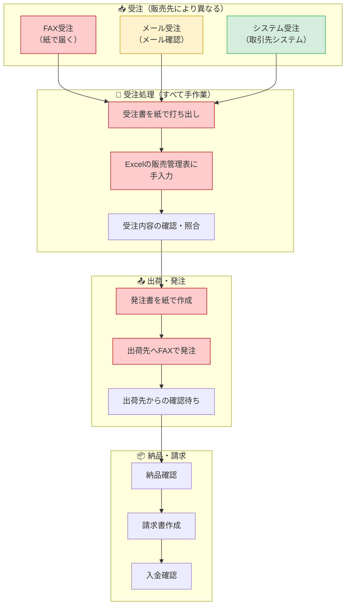
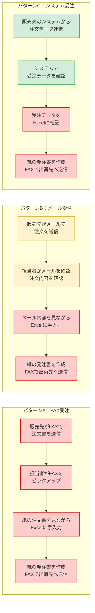
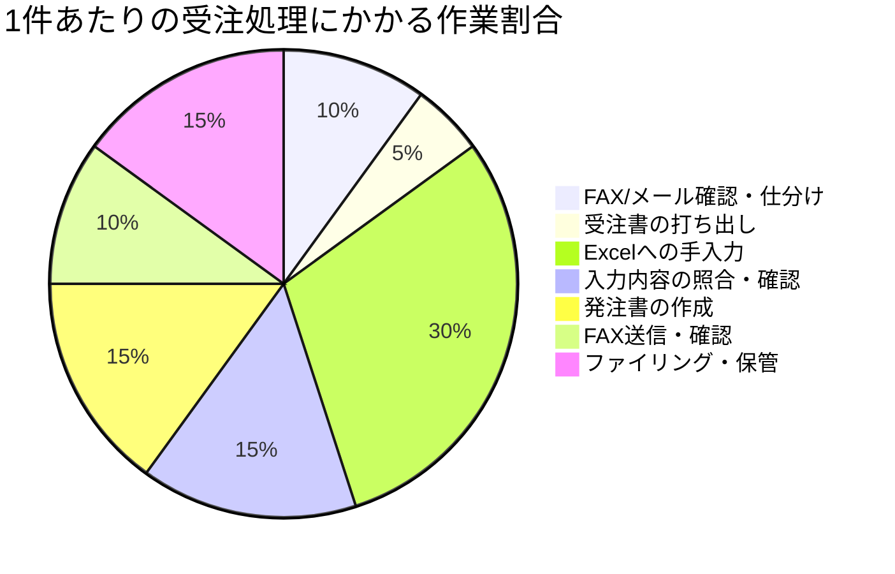

# 現状ワークフロー（As-Is）

## 全体フロー

### 凡例

- 🔴 赤：手作業・紙ベースの非効率なプロセス
- 🟡 黄：一部デジタルだが改善余地あり
- 🟢 緑：すでにデジタル化済み

---

## 販売先別の受注パターン

> **共通の課題**: どのパターンでも最終的に「Excelへの手入力」と「紙のFAX発注」に集約される

---

## 業務の時間配分（推定）

---

## 現状の課題まとめ

| # | 課題 | 影響 | 発生頻度 |
|---|------|------|----------|
| 1 | 受注チャネルがバラバラ（FAX/メール/システム） | 確認漏れ・対応遅延 | 毎日 |
| 2 | すべての受注をExcelに手入力 | 入力ミス・二重入力・時間浪費 | 毎日 |
| 3 | 発注がFAX（紙）ベース | 送信ミス・確認遅延・紙コスト | 毎日 |
| 4 | 受注～発注まで人手に依存 | 属人化・休暇時の業務停滞 | 常時 |
| 5 | データが分散（紙・Excel・メール） | 状況把握が困難・集計に時間 | 常時 |
