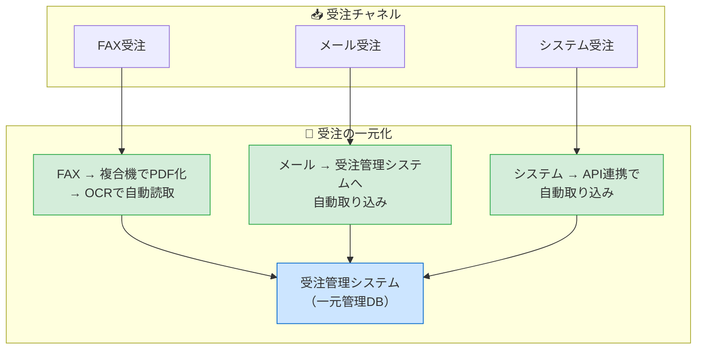
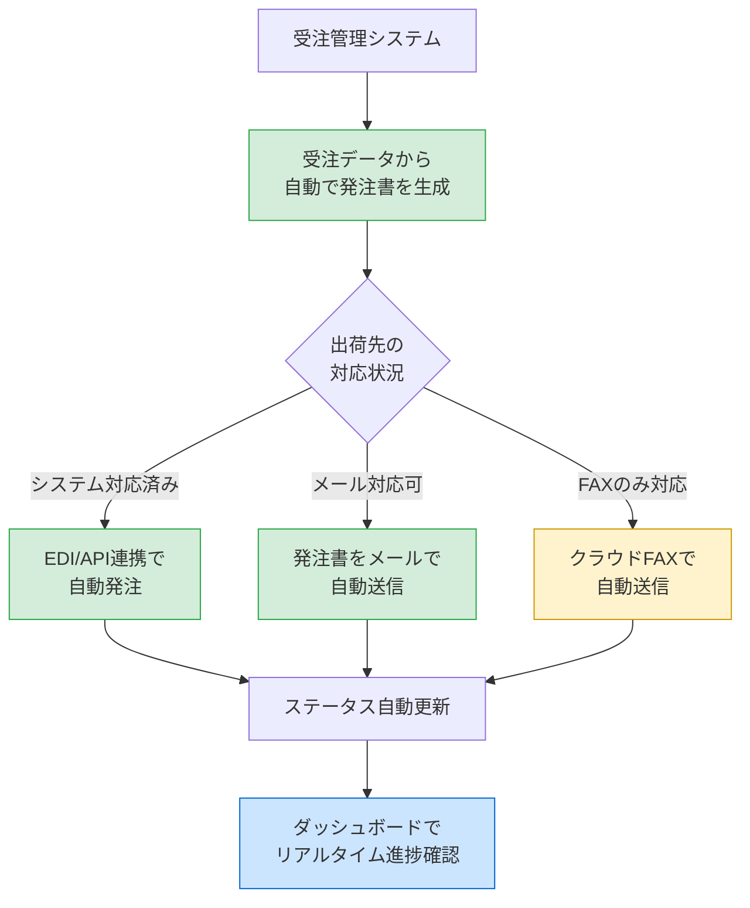
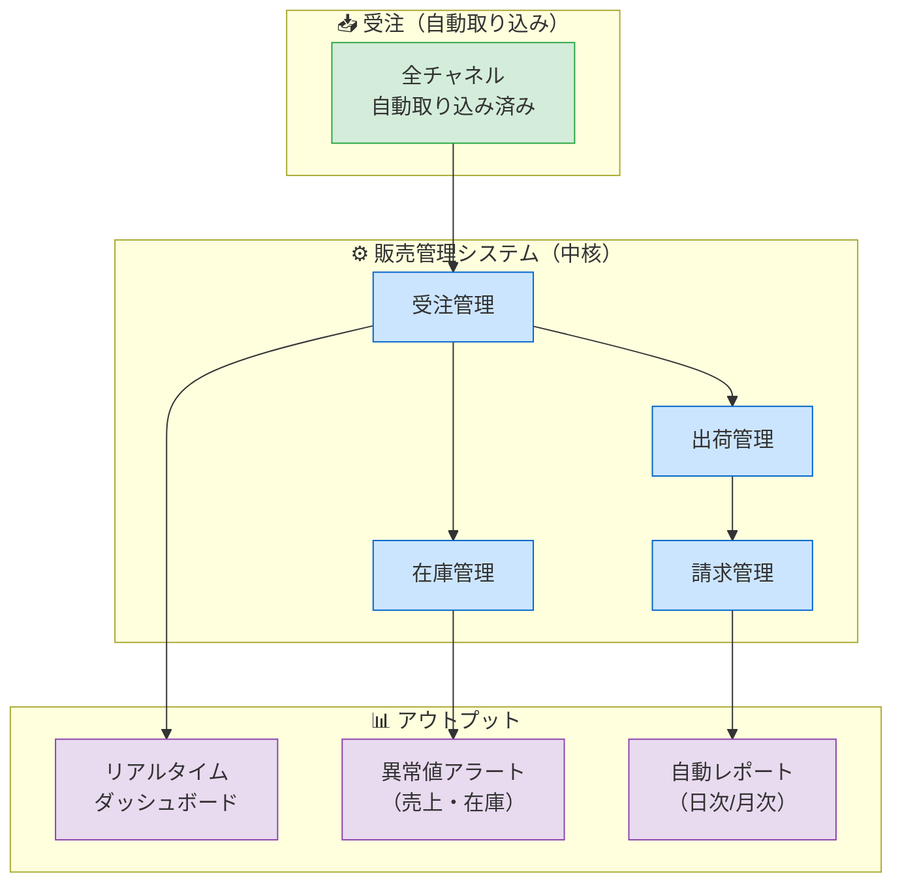
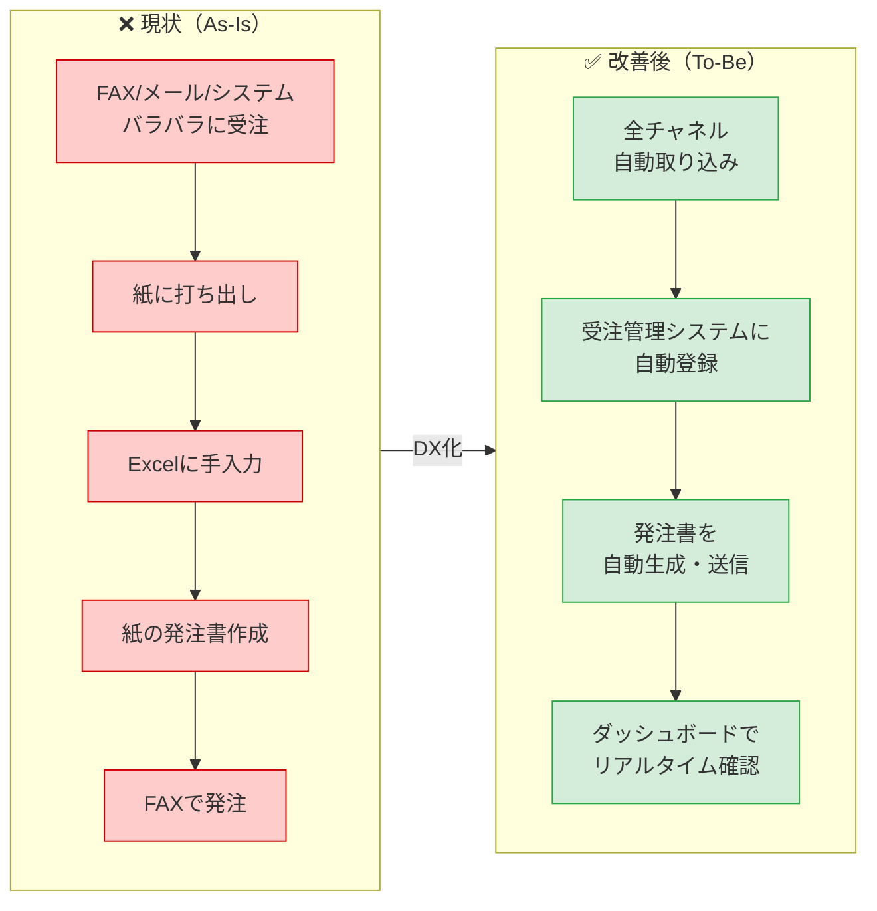

# 改善後ワークフロー（To-Be）

## Phase 1：受注の一元化（短期 〜3ヶ月）

> **効果**: Excel手入力をなくし、受注データを一箇所に集約

---

## Phase 2：発注の自動化（中期 3〜6ヶ月）

> **効果**: 手作業の発注書作成・FAX送信を廃止し、自動化

---

## Phase 3：全体最適化（長期 6〜12ヶ月）

---

## As-Is → To-Be 比較

